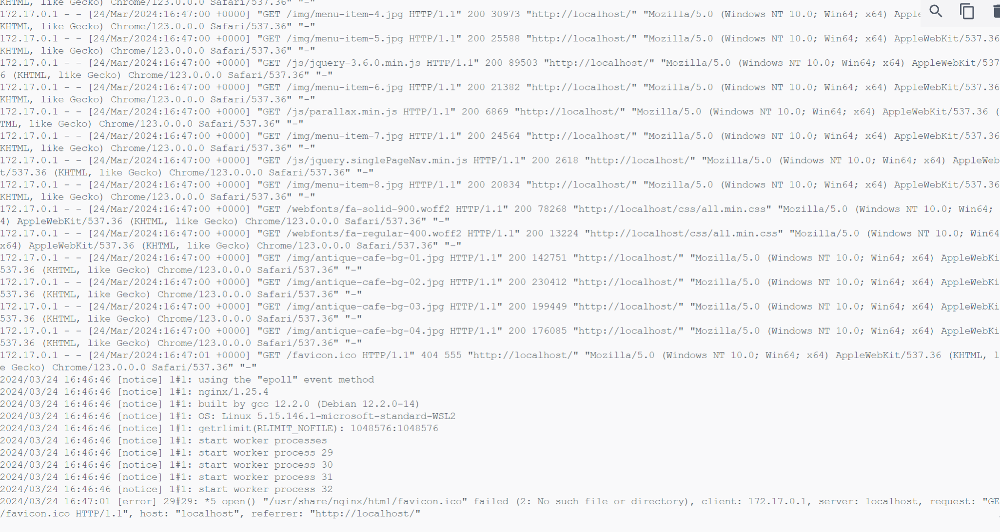

# PROJECT OVERWIEW
The project creates a docker image of a basic website off of Nginx image.

## STEPS
- I downloaded a website image online
- I created the `Dockerfile` inside the project folder
- Inside the Dockerfile  I wrote script to building the image
- I built the image using `docker build -t "image-name" .`
- After the build, I checked if my image was successfully built using `docker image`
- I ran my container using `docker run --name "container-name" -p "port" "image-name"`

IMAGE:
